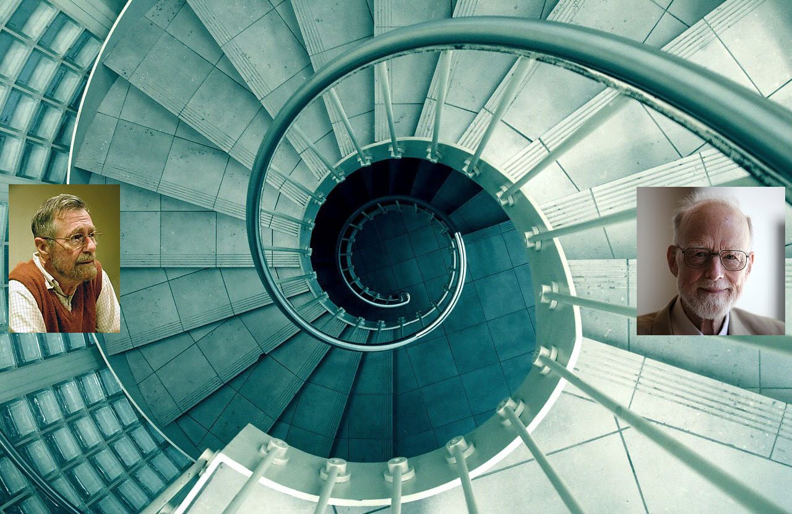

# QuickSort, Tony Hoare, Recursion, Algol 60, Dijkstra

Image source:
https://hackernoon.com/recursion-vs-looping-in-python-9261442f70a5
https://en.wikipedia.org

## Tony Hoare on QuickSort Invention

> I did in fact make perhaps my most famous invention while I was at Moscow State University, as a result of thinking about problems of translating languages. The first thing a computer would do on reading a sentence in a foreign language was to sort the words into alphabetical order, because in those days the dictionaries of a language would be held on magnetic tape, which could only be scanned from the beginning to the end. And if you sorted the words into order, in a single scan you could pull the articles for every word in a sentence rather than scanning the whole tape for each word. So I thought, that’s a nice exercise, how would I programme sorting the words using a very small main store of a computer. Erm … I thought of one method and thought, no, no, that’s a bit slow because it would take the number of words – you’d have to square it and you’d have to do something for every pair of words. And then I thought of a method which was better than that, that was called Quick Sort. I tried to programme it in Mercury Autocode, which was the only programming language I knew at that time, and I couldn’t quite organise it. But I thought, ah, something like this will work. And in the end that’s how it turned out, and now when I go to China or Russia or anywhere, that’s the thing that they all know that I’m famous for. So it illustrates a basic concept of problem solving, which is divide and conquer, and it uses a computing technique known as recursion, to use – to get the computer to use the same method to – to solve the smaller problems as you have told it to solve the bigger problem. I haven’t had it confirmed but people tell me that it’s still the most widely used method. It becomes more and more important as the main memory of the computer gets larger. It’s really quite effective. And it’s quite effective in the – even the extended backing stores that computers use nowadays, which are getting more and more random access. So I think the basic technique is still very applicable.
>  
> How old were you when you actually came up with the idea?
>   
> This would be 1960, so I was twenty-six.
>   
> Did you think at the time that this would be the thing that people would know you for half a century later?
> 
> No, I did not [laughs].

## Quick Sort Strategy
- Shuffle(To avoid worst case)
- Find pivot to partition array to two
- Do it recursively

## Why Tony Hoare Cannot Make it at 1960?
Recursion support! He implemented Shell Sort first and said he had a better solution than it.
His boss believes it's impossible. At 1961 he attended a course on ALGOL 60. Hoare said:

## Why Tony Hoare Made it at 1961
> During a course on the programming language ALGOL 60 (given by Edsger Dijkstra, Peter Landin and Peter Naur) Tony saw that the concept of recursion was the key to lucid expression of Quicksort. This contribution alone would have established Tony's reputation, but far more significant was the appreciation of the crucial role of programming languages that he took from this experience.

Tony Hoare said:
> [About Algol 60] Here is a language so far ahead of its time, that it was not only an improvement on its predecessors, but also on nearly all its successors.
> [About Algol 60] Due credit must be paid to the genius of the designers of ALGOL 60 who included recursion in their language and enabled me to describe my invention [Quicksort] so elegantly to the world.

## Reference
1. https://en.wikiquote.org/wiki/C._A._R._Hoare
2. https://en.wikipedia.org/wiki/Edsger_W._Dijkstra
3. https://vanemden.wordpress.com/2014/06/18/how-recursion-got-into-programming-a-comedy-of-errors-3/
4. http://horningtales.blogspot.com/2006/07/recursion.html
5. http://www.dijkstrascry.com/node/4
6. http://www.fibonacci.org/GHE7.pdf
7. https://amturing.acm.org/award_winners/hoare_4622167.cfm
